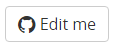

## Edit a Page

You can modify the desired page by clicking on the "Edit me" button at top of that page:



_Figure "The button to edit the desired page"_

You will be redirected to GitHub where the documentation page is located and you are able to use the edit feature of GitHub to change the content of it.

## Add a new Page

If you don't see any page where your content belongs to, you can also add a new documentation page for it.

1. Add your page via GitHub
   Go to [Doc folder on GitHub](https://github.com/Communote/communote.github.io/tree/master/doc) and upload your existing Markdown file or click on the "Create new file" button to create it from scratch.
2. Do not forget the header of the file:

   ```
   ---
   title: The title of the Page
   tags: [categorytag]
   keywords: some, keywords, for, the, search
   ---
   ```
3. Add your page to the sidebar navigation
   The sidebar.yml file contains the structure of the documentation. You need to add your file to the right place (please follow the existing structure) and your page will show up at the sidebar navigation.
   Please note that you need to set the file extension *.html* instead of *.md* at the URL because Jekyll will render it as an HTML file.


## Change the Design or Structure

If you want to change the design or structure of the documentation you better set up the Communote GitHub Page locally. [This Github Help article](https://help.github.com/articles/setting-up-your-github-pages-site-locally-with-jekyll) explains how you can do this.

The design is defined with LESS. When you change LESS files you only need to compile the ```global.less``` file to ```css/global.css```.

## Update Javadoc

After a new Communote version has been released the generated javadoc documentation should be updated too. This can be done like this:

1. Remove the content of the directory ```generated/javadoc```.
2. Start the Javadoc creation by running the following command in the ```communote``` directory of the [communote-server](https://github.com/Communote/communote-server) checkout. The documentation will be created in ```target/site/apidocs```. Errors reported by Maven can usually be ignored.

   ```shell
   mvn javadoc:aggregate
   ```
   
3. Copy the content of ```target/site/apidocs``` to the ```generated/javadoc``` directory, but exclude the files ```options``` and ```javadoc.bat```.
4. Commit :)

## Update REST API Documentation

If the REST API of the latest API version was updated or a new version was created the documentation should be updated too. This can be achieved like this:

1. Remove the content of the directory ```generated/rest-api```.
2. Start the generation of the REST API documentation by invoking the following command in the ```doc``` directory of the latest REST API plugin within your [communote-server](https://github.com/Communote/communote-server) checkout.

   ```shell
   mvn
   ```

3. Copy the content of the ```target/site``` directory to ```generated/rest-api```, but exclude the file ```pdf-config.xml```.
4. Create a directory named ```pdf``` in ```generated/rest-api```.
5. Copy the PDF file from ```target/pdf``` to ```generated/rest-api/pdf/```.