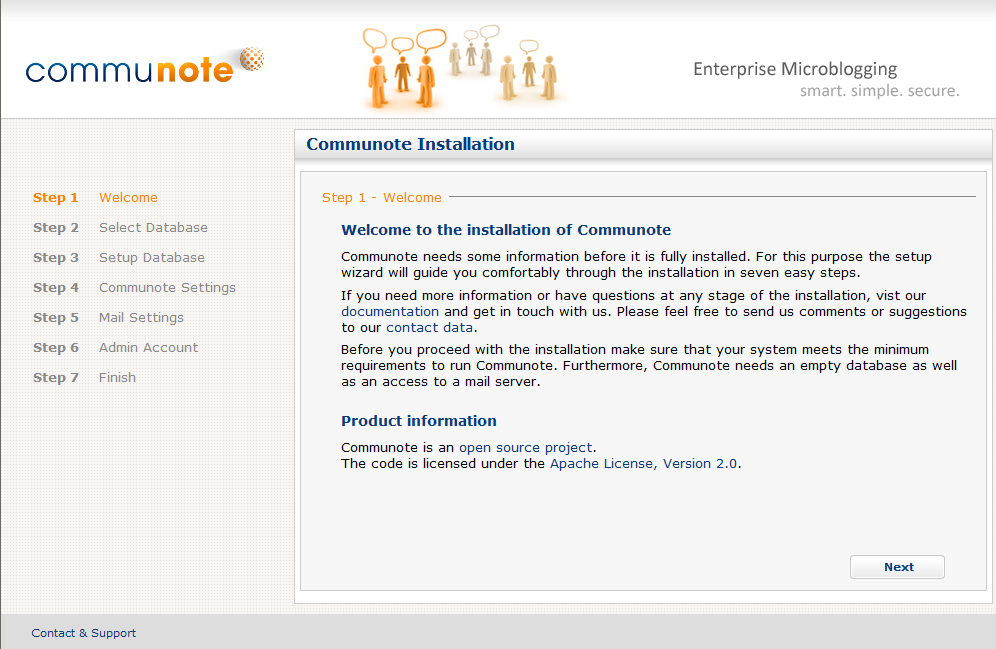

## 2.1 Types of installation

There are different ways to install Communote:

**Installation with an installation package**

There are special installation packages for Linux and Windows which already contain a preconfigured Apache Tomcat server. This reduces the initial configuration but makes an update of the Tomcat server a bit more complicated.  
The available packages are:
* a Windows 32-bit package which includes the Windows service wrapper and the compiled APR/native library for use with 32-bit JVMs
* a Windows 64-bit package which includes the Windows service wrapper and the compiled APR/native library for use with 64-bit JVMs
* a Linux package which actually is a generic package because it does not contain any native code
 
The Windows packages have a .zip and the Linux package has a .tar.gz file-ending.

**Installation by WAR-File**

The installation by WAR file is the most flexible way to setup Communote but requires a little more configuration.

To download the various packages or upgrade to a new version, visit the download area of our github project: https://github.com/Communote/communote-server/releases

## 2.2 Create Database

As described in [system requirements](install_requirements.html) Communote supports PostgreSQL, MySQL, Microsoft SQL-Server and Oracle as database management system. The details for creating a database with the correct encoding for each system are outlined below.

### 2.2.1 PostgreSQL

Start the PostgreSQL shell 'psql' and login with a user with enough privileges to create a database:

```bash
psql -U postgres -W
```

First you should create a dedicated database user for the Communote database. This can be done with the following statement in the PostgreSQL shell:

```sql
CREATE USER communote_db_username NOCREATEDB NOCREATEROLE NOCREATEUSER ENCRYPTED PASSWORD 'communote_db_password';
```

Replace `communote_db_username` and `communote_db_password` with the name of the database user and the password of that user.

The database can then be created as shown below. The `communote_db_name` needs to be replaced with the name of the new database.

```sql
CREATE DATABASE communote_db_name OWNER communote_db_username ENCODING 'UTF8';
```

### 2.2.2 MySQL

Start the MySQL client and login with a user with enough privileges to create a database:

```bash
mysql -u root -p
```

Then create a database for Communote and replace `communote_db_name` with the name of the database which should be used by Communote:

```sql
CREATE DATABASE communote_db_name CHARACTER SET utf8 COLLATE utf8_general_ci;
```

For security reasons a separated database user should be created and the database access to the Communote database should be limited to this user. To do this execute the following statements in the MySQL shell:

```sql
GRANT ALL PRIVILEGES ON communote_db_name.* TO 'communote_db_user'@'IP_COMMUNOTE_SERVER' IDENTIFIED BY 'communote_db_password';
FLUSH PRIVILEGES;
```

Replace `communote_db_name`, `communote_db_user` and `communote_db_password` with the database name, the database user and the password of that user. The `IP_COMMUNOTE_SERVER` needs to replaced by the IP of the Communote server.

### 2.2.3 Microsoft SQL-Server

For creating the database start the Microsoft SQL Server Management Studio. There you should first add a dedicated user for the Communote database:
* select Security -> Logins -> New Login
  * provide the 'Login name'
  * select 'SQL Server authentication' and insert a password
  * choose English as 'Default langauge'

After this create a new database:
* Choose new database
  * insert the 'Database name'
  * select the dedicated user as 'Owner'
  * define Latin1_General_100_CS_AS as 'Collation' in the 'Options' tab

Finally you should install the Full-Text Search component to get full-text search support in Communote.

### 2.2.4 Oracle

For correctly installing and configuring the Oracle 11g database please refer to the [Oracle Documentation](http://docs.oracle.com/cd/B28359_01/nav/portal_11.htm). Make sure to select 'AL32UTF8' as character-set.

A new user shema for Communote can be created as administrator with following commands. Replace 'COMMUNOTE' and the password accordingly.

```sql
CREATE USER "COMMUNOTE" PROFILE "DEFAULT" IDENTIFIED BY "*******" DEFAULT TABLESPACE "COMMUNOTE" TEMPORARY TABLESPACE "TEMP" ACCOUNT UNLOCK

GRANT UNLIMITED TABLESPACE TO "COMMUNOTE"
GRANT "CONNECT" TO "COMMUNOTE"
GRANT "CTXAPP" TO "COMMUNOTE"
GRANT "RESOURCE" TO "COMMUNOTE"
```

## 2.3 Installation

### 2.3.1 Preparations

Before Communote can be installed your server has to be prepared:

1. Download and install the latest Oracle Java Runtime Environment (JRE) of version 8 (http://www.java.com/en/download/). After the installation of Java check that the correct version is returned when executing the command:

   ```bash
   java -version
   ```

2. Download a JDBC driver for your database management system. The installation of the driver, which is a JAR file, will be described in the individual installation sections.
  * PostgreSQL: the JDBC driver is available at [https://jdbc.postgresql.org/download.html](https://jdbc.postgresql.org/download.html). You should typically pick the current JDBC42 driver but please also read the documentation on that page.
    * _Note: if you are using the Linux or Windows installation package this step can be skipped because the driver is already contained_
  * MySQL: the JDBC driver can be downloaded from [http://dev.mysql.com/downloads/connector/j/](http://dev.mysql.com/downloads/connector/j/). You need a driver with version 5.1.x (e.g. 5.1.39).
  * Microsoft SQL-Server: the JDBC driver is available at [http://jtds.sourceforge.net/](http://jtds.sourceforge.net/).
  * Oracle: a suitable JDBC Thin driver can be downloaded from [http://www.oracle.com/technetwork/indexes/downloads/index.html](http://www.oracle.com/technetwork/indexes/downloads/index.html). You should take the ojdbc6.jar.
3. Download the Communote package you want to install from [GitHub](https://github.com/Communote/communote-server/releases).
 
Now you can install Communote by following the steps in section 2.3.2 if you selected a Windows or Linux installation package or the instructions of section 2.3.3 if you want to use the WAR file.

### 2.3.2 Installation with an installation package

To install Communote from the Linux or Windows installation package follow the instructions below:

1. Unzip or untar the downloaded package into an arbitrary directory. This directory now contains among others a directory named 'communote' which you copy into your preferred installation directory (`COMMUNOTE_INSTALL_DIR`).
2. When not using a PostgreSQL database copy the previously downloaded JDBC driver for your database to `COMMUNOTE_INSTALL_DIR/communote/lib`.
3. Configuration:
   1. Define the Communote configuration directory. Edit the file `COMMUNOTE_INSTALL_DIR/communote/conf/context.xml` and add the following entry in between the elements `<context>` and `</context>`:

      ```xml
      <Environment name="communote.config.dir" type="java.lang.String" value="absolute path to configuration directory" />
      ```

      You can use the prepared configuration directory `COMMUNOTE_INSTALL_DIR/communote/conf/communote`

   2. Configure the data directory which Communote will use for storing application data. This directory will also be used as the default location for saving attachments.
      1. Create a file called `startup.properties` in the Communote configuration directory.
      2. Add the absolute path to the data directory to the `startup.properties` file as shown in the following example. You should not select a directory within `COMMUNOTE_INSTALL_DIR/communote/communote/` because this would allow users to access the content of that directory directly from their web browsers.
      
      ```ini
      communote.data.dir=C\:/Communote/communote-data
      ```
      
      **Note for Windows**: The colon (':') has to be escaped with a backslash and all backslashes in the path have to be replaced by normal slashes as shown in the example.
4. Optional for Linux systems (recommended): Create or select a special user without root access that should be able to run Communote. This user needs to have read and write access to the data directory and should be the owner of the Communote installation directory.
5. Now you are ready to start Communote. To do this, go to the directory `COMMUNOTE_INSTALL_DIR/communote/bin` and run Communote with `startup.bat` (Windows) or `startup.sh` (Linux, make sure to run the script as the correct user!).

Continue the installation with the [web installer](#set-up-communote-with-the-web-installer).

### 2.3.3 Installation by WAR-File

To install Communote from WAR file follow the instructions below.

1. Get and install the Apache Tomcat version mentioned in the [system requirements](install_requirements.html).
2. Copy the downloaded JDBC driver for your database management system to the `lib` directory of your Tomcat installation.
3. Create a directory which can be used by Communote for storing application data. This will be the Communote data directory and might for example be named `communote-data`.  
  **Important**: this directory **must not** be a subdirectory of the Tomcat installation directory!
4. Create a Communote configuration directory.
5. Create a new file named `startup.properties` in the Communote configuration directory and add the absolute path to the Communote data directory as shown in the example:
    
    ```ini
    communote.data.dir=C\:/Communote/communote-data
    ```
    
    **Note for Windows**: The colon (':') has to be escaped with a backslash and all backslashes in the path have to be replaced by normal slashes as shown in the example.
6. Open the file `conf/context.xml` of your Tomcat installation and add the following lines between the elements `<context ...>` and `</context>`. Replace the value for `communote.config.dir` with the absolute path to your Communote configuration directory. The path must be in the format of your operating system (slash for Linux and backslash for Windows). Escaping characters as in step 5 is not necessary.
  
  ```xml
  <Environment name="communote.instance.name"
      type="java.lang.String"
      value="communote" />
  <Environment name="communote.config.dir"
      type="java.lang.String"
      value="Absolute path to the directory that contains startup.properties without any escaping" />
  ```
  
7. Optional for Linux systems (recommended): Create or select a special user without root access that should be able to run Communote. This user needs to have read and write access to the Communote configuration and data directories and should be the owner of the Tomcat installation.
8. Copy the Communote WAR file to the `webapps` directory of your Tomcat installation and rename it to 'ROOT.war'. In case there is already a directory named 'ROOT' in the `webapps` directory, remove it.
9. Java system parameters
  1. For a stable Communote installation some Java system parameters need to be adjusted. Tomcat provides the `JAVA_OPTS` environment variable for this kind of customization. This variable can be defined in the `bin/sentenv.bat` (Windows) or `bin/setenv.sh` (Linux) files of the Tomcat installation. Our recommendations for a normal installation are:
    
    ```bash
    # Linux
    JAVA_OPTS="${JAVA_OPTS} -server -Djava.awt.headless=true -Xms256m -Xmx768m -Dorg.apache.jasper.compiler.Parser.STRICT_QUOTE_ESCAPING=false"
    ```
    
    ```bat
    rem Windows
    set JAVA_OPTS=%JAVA_OPTS% -server -Djava.awt.headless=true -Xms256m -Xmx768m -Dorg.apache.jasper.compiler.Parser.STRICT_QUOTE_ESCAPING=false
    ```
    
  2. On a server without a graphical user-interface the parameter ```-Djava.awt.headless=true``` is **required**.
  3. On a 32-bit Windows system the parameter ```-server``` must **not** be used.
10. Now you can start your server. Make sure to do this as the correct user on Linux.

## 2.4 Set-up Communote with the web installer

Start your browser for completing the installation and go to the homepage of your Communote instance. By default it will be available at [http://localhost:8080/](http://localhost:8080/).

Now you should see the start screen of the web installer:



_Figure "Communote Installer Startpage"_

The web installer will guide you through the installation. When you are done you will be forwarded to the login page of Communote where you can log in with the credentials of the administrator you provided in step 6 of the web installer.
