The interface of Communote is built to help you in your daily communication and to assist you in researching previously created content. In this chapter the basic interface will be explained. A detailed description of the functions can be found in the following chapter.

## 1.1 Register to Communote

In order to register to Communote, you only need to type in your email address in the registration form (see Figure "Login & Registration"). You will then receive an e-mail with an automatically generated link to complete the registration process.

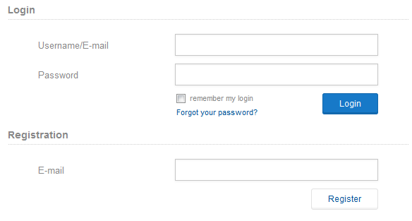

_Figure "Login & Registration"_

Your Communote system may not be open to all users. In that case your Communote account is not automatically activated after completing the registration. So before you can start using Communote an administrator of the system has to confirm your registration.

## 1.2 Login to Communote

Using Communote always starts with logging in. In order to do so, go to the Communote login page and provide your login name and password. If you want to be logged in automatically in the future, check "remember my login".
After the login you will see the main page of Communote.

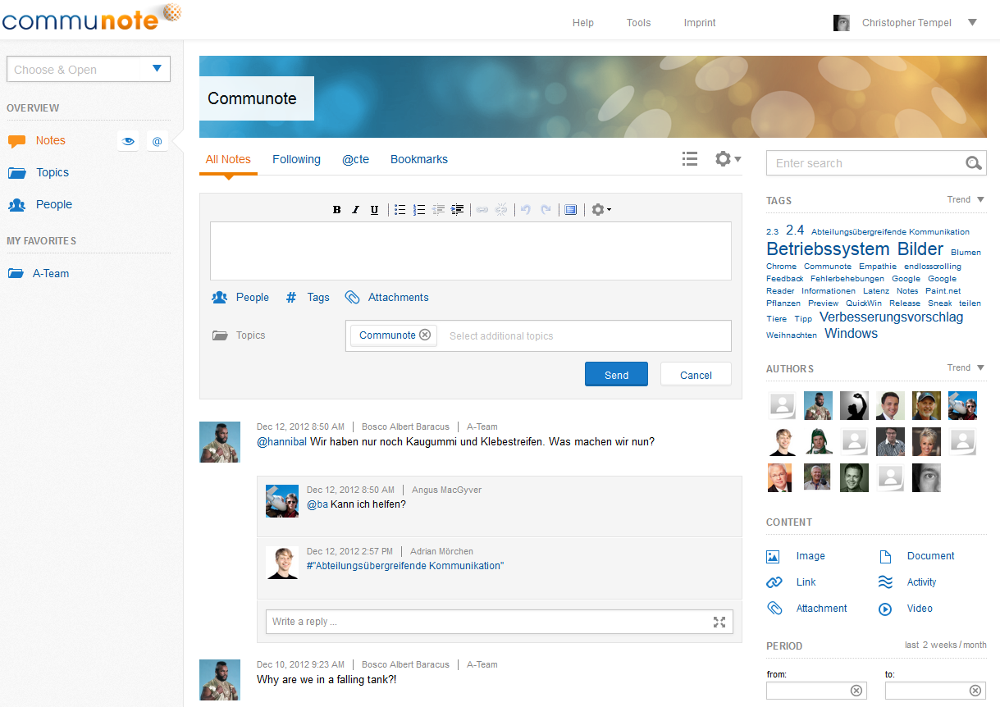

_Figure "Communote Interface"_

## 1.2 Topbar

In the upper part of the interface you can see links to the "Help", "Tools" and "Imprint" pages and a link to your profile. The "Help" page contains additional information on using Communote like short video tutorials and a link to this documentation. The "Tools" page lists utilities for working with Communote like the bookmarklet. The "Imprint" page shows the terms of use and the imprint of your Communote. When hovering the profile link the user menu will open. The user menu contains links to edit your profile and log yourself out.

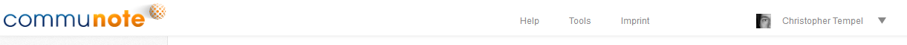

_Figure "Topbar"_

## 1.3 Navigation and Favorites on the left sidebar

On the left hand side of your screen you can choose in which context you would like to work. When choosing "Notes" you will be guided to an overview of all messages in the system that you are able to see. This is also the welcome screen that you were brought to after logging in into Communote.

The views which are reachable by the "Topics" and "Persons" links will show you all the topics you are allowed to see and the users which are in the system. You can also search for a specific topic, user or tag by starting to type in the "Choose and open" field. The system will suggest you matching items for direct access (see figure "Sidebar").

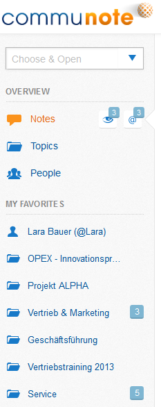 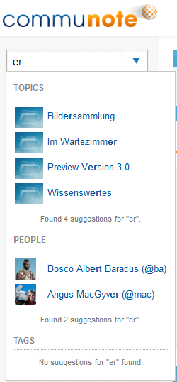

_Figure "Sidebar" (left) and with auto suggest (right)_

## 1.4 Basic Functions

### 1.4.1 Write a message

The note input field consists of an input box with different options for formatting. Several other options for writing a note are listed below the input field.

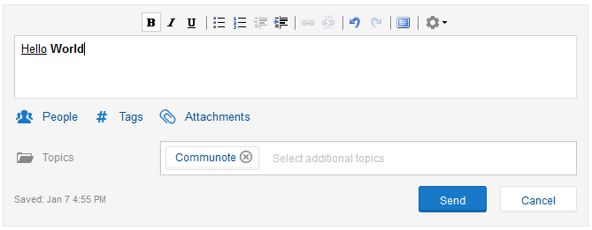

_Figure "Note Input Field"_

**Note:** If you are already familiar with the older Version of Communote (2.4), you will notice that the topic selection is not available above the editor anymore. You will now find that function below the editor and you can also choose more than one topic where the message should be posted.

### 1.4.2 Read Messages

You can find the message feed right in the middle of the interface taking up the majority of Communote's interface. That's because Communote is all about the exchange of information and communicating!
In this section we will be explaining the layout of Communote's interface.

Between the banner on top and the editor you can see the tab section. This section changes depending on the area of Communote you're in:
If you find yourself in the overview page for notes ("notes" at the left sidebar) you will see "All notes", "Following", "@[YourName]" and "Bookmarks".

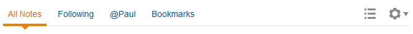

_Figure "Tab-Area Global"_

If you selected a specific topic, for instance via the "Choose and open" field, these tabs will change into "Notes", "Subtopics", "Members", and "Info".

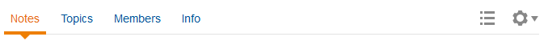

_Figure "Tab-Area Context"_

Below the editor you can find all notes you are allowed to see. The list of notes is sorted by date of creation downward (_meaning that new notes are on top and older notes are below_). A note consists of text, the profile picture of the author, the date of creation, and the topic that the note was posted in (see figure "Note"). Furthermore, other users can be notified about the note by being linked to the note using @mentions. Tags and attachments can also be added to the note. Users that have been mentioned and tags that are included are shown as a (blue) link within the note. If you click on that link, you are shown a list of notes that is filtered by that person or tag.

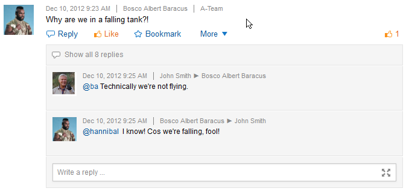

_Figure "Note"_

You can easily add Video-Links (YouTube or Vimeo) to your note's text. After you post these links into the message body, they will automatically be transformed into inline videos which can be played directly in Communote (see figure "Pictures & Videos inline").

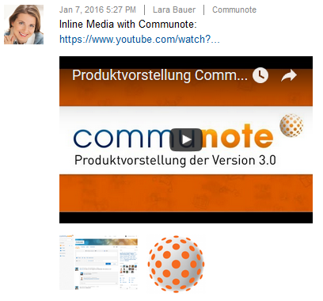

_Figure "Pictures & Videos inline"_

Notes that are older than the notes shown on the initial screen will be loaded automatically via "endless scrolling". If you need to get back to the top quickly, you can use the "back to top"-Button, which will show up on the left hand side as you get further down the page.

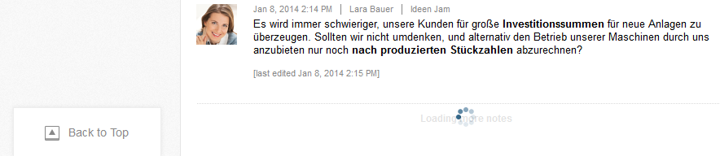

_Figure "Endless Scrolling"_

Within the list of notes, Communote has a special display for users, tags, and topics: Small hover cards with the most essential information and functions will be shown when you place the mouse over a user, a tag or a topic. For example, if you place the mouse pointer over the profile picture of a user the hover card will show the name, position, phone number and tags of this user (if she provided the information in her profile). Additionally the function "following" is available.

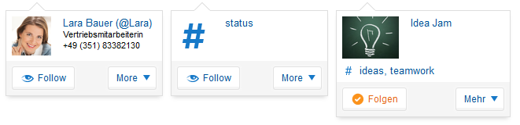

_Figure "Hover Cards"_

### 1.4.3 Search Notes

On the right side of the interface you can find an area for searching and filtering the content. On the upper part, there is a search field in which you can search Communote for a **specific term**. Communote will also suggest you tags used in notes and authors of notes based on your input.

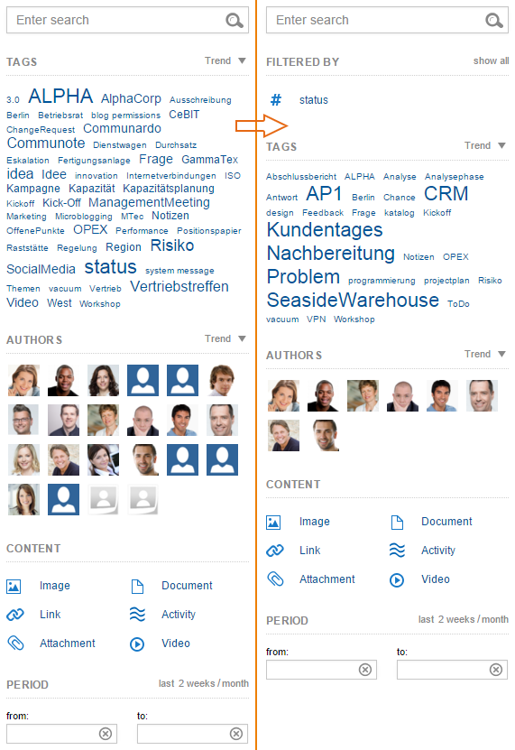

_Figure "Search": Search sidebar normal (left) and the search sidebar with suggested filters for the filtered tag "status" (right)_

All active filters are listed under "Filtered By". The tag cloud, the authors and the topic filter will match with an active filter.

More details for the different filters will be explained in Chapter 2.3.

If you have selected a specific topic, person or tag via the "Choose and open" field other filters will be available. So for example if you select a topic the filters will include options to reduce the notes to those you were mentioned in, you have in your bookmarks or are among the followed notes. Additionally a filter for subtopics will be shown if there are any.

**Note:** If you are using the full text search, notes that are activities will not be included in the results. Only if you are using the tag- or author search those results will be included.
