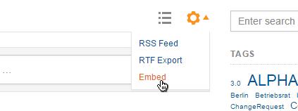

It is possible to embed streams of Communote topics into any website. Therefore you have to copy and paste a special embed code (a JavaScript snippet) into the HTML code of your website.
Even in embedded topic streams you can write, comment and like messages - as easy as you already know it from the regular Communote. The embed code can be reached from the actions menu of the stream.



_Figure "Embed option"_

The embed code contains the JavaScript function ```communote.embedCommunote``` which accepts 2 parameters. The first parameter identifies the HTML element in which Communote should be embedded. The second is an object which can be used to configure the embeded Communote. Currently the following settings are supported:

| Parameter Name   | Datatype | Default | Description |
| ---------------- |-----------------|-----------------|-----------------|
| edShowCreate | boolean | true | If true the the editor to create new notes will be shown |
| edPreselectedTopicId | integer | | ID of a topic to preselect it in the editor for creating new notes. Has precendence over edPreselectedTopic. |
| edPreselectedTopic | string | | The alias of a topic to preselect it in the editor for creating new notes. |
| msgShowViews | string | 'all,following,mentions,favorites' | Defines the selectable views of the note feed. The supported values are 'all', 'following', 'mentions' and 'favorites'. It is possible to define that more than one view should be shown by specifying the view names in comma separated form (without whitespace). Moreover, when passing an unknown view like 'none' the view selection will not be shown.|
| msgViewSelected | string | 'all' | Defines the view of the note feed which should be shown after loading. The supported values are 'all', 'following', 'mentions' and 'favorites'. |
| fiShowFilter | boolean | true | If true the filter area will be shown, otherwise no filters will be shown even if one of the other fiShow parameters is set. Which of the filters should be shown can be defined with the other fiShow parameters. |
| fiShowSearch | boolean | true | If true the search field will be shown. |
| fiShowTopic | boolean | true | If true the topic filter will be shown. |
| fiShowTagCloud | boolean | true | If true the tag cloud will be shown. |
| fiShowAuthor | boolean | true | If true the note author filter will be shown. |
| fiShowContentType | boolean | true | If true the note content type filter will be shown. |
| fiShowDate | boolean | true | If true the note creation date filter will be shown. |
| fiPreselectedTopics | string | | A string with a comma separated list of topic aliases to reduce the notes to those which were created in the given topics. If not provided the feed shows the notes from all topics the user is allowed to read. |
| fiPreselectedTopicIds | string | | Like fiPreselectedTopics but as a list of comma separated topic IDs. |
| fiPreselectedTagIds | string | | A string with a comma separated list of IDs of tags to reduce the notes to those which have the given tags. |
| fiPreselectedAuthors | string | | A string with a comma separated list of user (login) names to reduce the notes to those which were created by the given users. |
| fiPreselectedAuthorsIds | string | | Like fiPreselectedAuthors but as a list of comma separated user IDs. |
| height | string or integer | 'auto' | The fixed height of the HTML element containing Communote in pixels. In case Communote needs more space, scrollbars will be shown. If 'auto' is used Communote takes up as much space as it needs. |
| maxHeight | integer | | Maximum height of Communote in pixels. This setting only has an effect if height is set to 'auto'. In this case the element containing Communote will grow until this maximum is reached and if more space is required scrollbars will be shown. |
